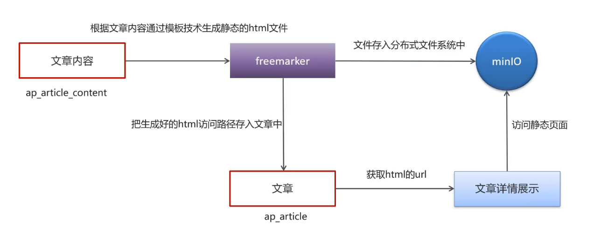
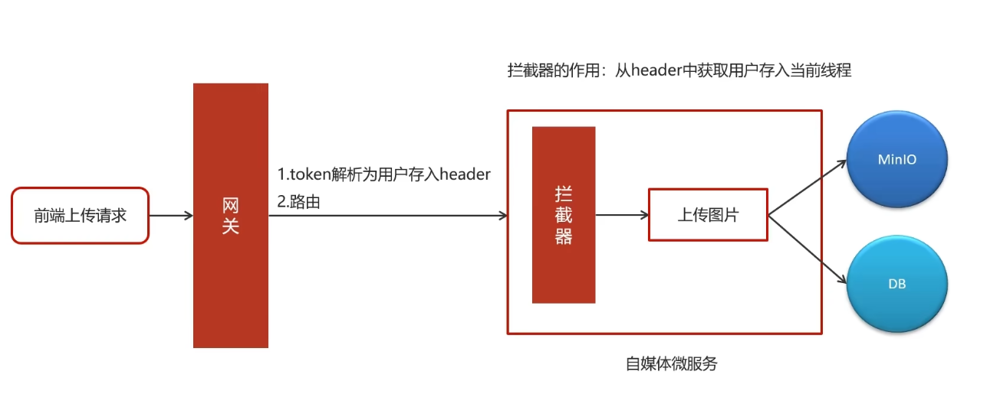

# 热点头条

## app端文章列表

### 表的拆分-垂直分表
垂直分表：将一个表的字段分散到多个表中，每个表存储其中一部分字段。
优势：
1. 减少IO争抢，减少锁表的几率，查看文章概述与文章详情互不影响
2. 充分发挥高频数据的操作效率，对文章概述操作的高效率不会被操作文章详情数据的低效率所拖累

拆分规则
1. 把不常用的字段单独放在一张表
2. 把text，blob等大字段拆分出来放在一张表
3. 经常组合查询的字段单独放在一张表中

#### 实现思路
1. 在默认频道展示10条文章信息
2. 可以切换频道查看不同种类文章
3. 当用户下拉可以加载最新的文章（分页）本页文章列表中发布时间为最大的时间为依据
4. 当用户上拉可以加载更多的文章信息（按照发布时间）本页文章列表中发布时间最小的时间为依据
5. 如果是当前频道的首页，前端传递默认参数：maxBehotTime：0（毫秒）minBehotTime：20000000000000（毫秒）2063年

### 静态模版展示
#### 实现思路

## 自媒体端
### 如何获取用户信息

